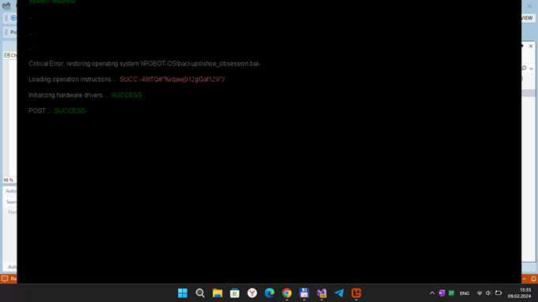
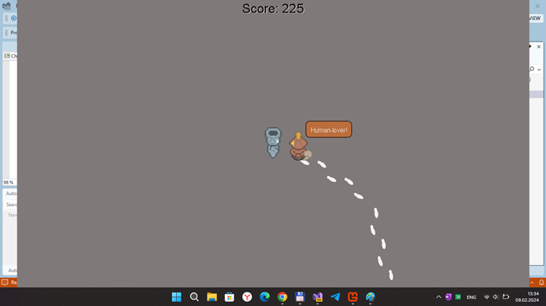

## ChasingGhosts v1.0.1 ("the-sad-robot-shoe-chase" codename; pre-pre-alpha)

This is my fork of the desktop monogame "the-sad-robot-shoe-chase" demo project:
https://falgantil.itch.io/the-sad-robot-shoe-chase

My main goal is: explore ninject + Sharp2D game mechanics & adapt it for W10M (Astoria support planned too) ;)

## Screenshot(s)

## My 2 cents (status)
- Fast R.E.... 
- Project tuned on(to) "firm" Monigame.Framwork 3.8.xx...
- Some project research and minimal "re-dev"...
- W10(M) UWP template not ready ready... ("Game components" is hardcore!)

## A few words (description) frow the author(original)

The sad robot shoe chase
Team (Credits): Falgantil, Karob, Whelp & Polpositi

Here's a list of things to know before you play the game:

This is a submission for a 1-week gamejam, expect the gameplay to reflect as such.

To skip the Prologue screen, press any key.

To use your sneakers (the first shoes you encounter) press Space (Keyboard), Rightclick (Mouse) or A (Gamepad).

## Goals (ToDo-s)
- Create Wiki
- Explore Becher's super-cool object-oriented programming
- Add more indicators / virtual gamepad, etc.
- Add more gameplay elements
- Improve AI
- Add story elements
- Add more sound effects for everything :)

## Reference(s)
- [Falgantil](https://falgantil.itch.io/) Falgantil at itch.io (author of original ChasingGhosts proto)
- https://github.com/ecp4224/Sharp2D
- [https://github.com/Falgantil](Bjarke) Falgantil
- https://github.com/qbus00/ninject.pcl111  NET 1.4 "fork to explore" ;) 

## ..
As is. No support. RnD only. DIY.

## .
[m][e] 2024

